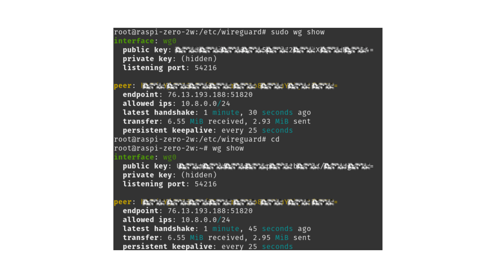
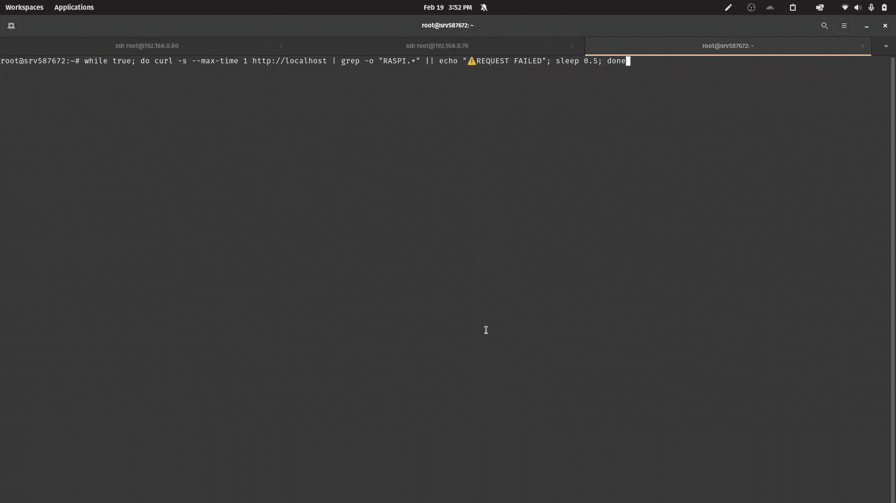
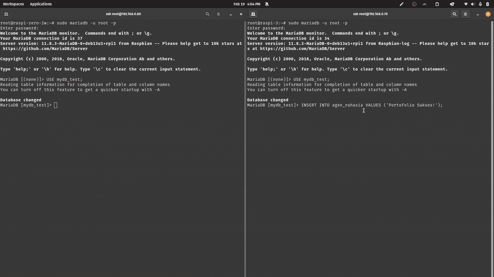
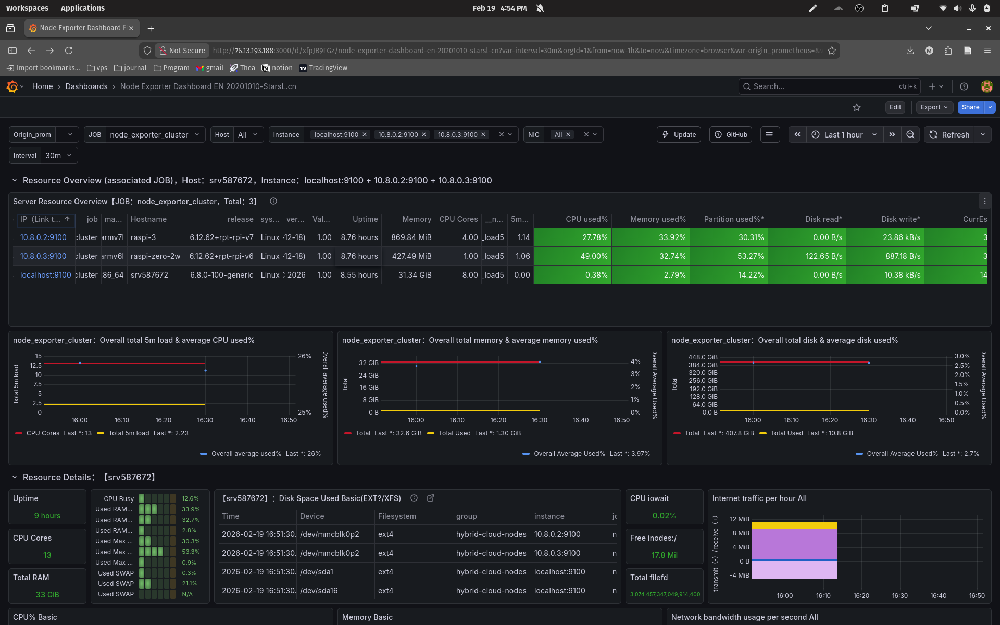
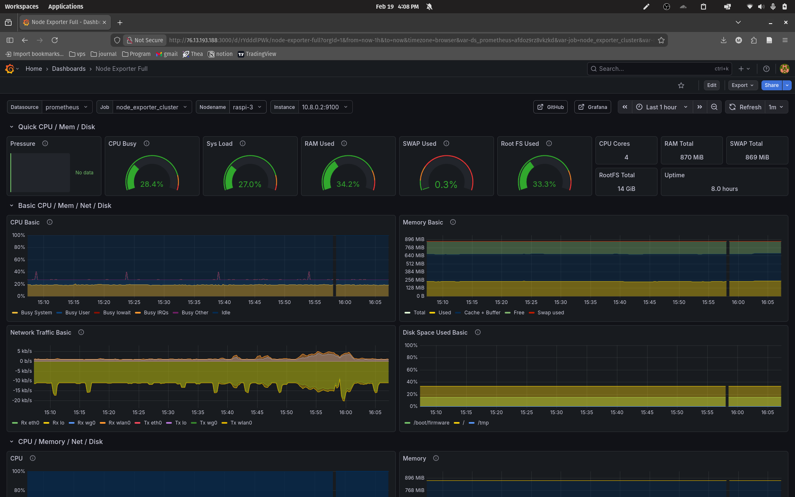

# ☁️ High-Availability Hybrid Cloud Cluster (Arsitektur Edge-ke-Cloud)

## 📖 Ringkasan Proyek
Proyek ini adalah hasil eksperimen saya dalam membangun infrastruktur **Hybrid Cloud** yang "kebal mati" (*self-healing*). Idenya adalah menggabungkan VPS Cloud publik dengan perangkat lokal (2 buah Raspberry Pi) yang ada di kamar saya, menembus batasan jaringan NAT bawaan WiFi.

Fokus utama arsitektur ini ada tiga: **High Availability tanpa *downtime***, **Replikasi Data Real-Time**, dan **Jaringan VPN yang aman**. Proyek ini menjadi bukti kalau sistem sekelas *Enterprise* itu bisa dibangun pakai *hardware* pinggiran yang terjangkau, asalkan kita paham cara *engineering*-nya.

---

## 🏗️ Topologi Arsitektur

Jaringan ini menggunakan topologi VPN *Hub-and-Spoke* (subnet `10.8.0.x`) supaya VPS dan Raspi bisa saling komunikasi seolah-olah dicolok di satu *switch* yang sama.

1. **Pusat (Cloud Node):** Ubuntu VPS (IP Publik)
   - **Tugas:** Jembatan VPN, Nginx Load Balancer, dan Pusat Ruang Kontrol (Prometheus + Grafana).
2. **Cabang A (Edge Node 1):** Raspberry Pi 3
   - **Tugas:** Web Server Worker A & Database MariaDB (Master).
3. **Cabang B (Edge Node 2):** Raspberry Pi Zero 2 W
   - **Tugas:** Web Server Worker B & Database MariaDB (Slave).

---

## 🚀 Fitur Utama & Pencapaian Sistem

### 🛡️ 1. Jaringan "NAT Punching" yang Aman (WireGuard)
- **Tantangan:** Raspi lokal nggak bisa diakses dari luar karena terhalang sistem NAT dari provider internet.
- **Eksekusi:** Saya bangun jaringan Mesh VPN pakai WireGuard (UDP 51820). Di sisi Raspi, saya tambahkan config `PersistentKeepalive` supaya *router* nggak mutus koneksinya pas lagi diam.
- **Hasil:** Tercipta jalur "terowongan" privat yang dienkripsi. Sekarang VPS di awan dan Raspi di kamar bisa ngobrol bolak-balik tanpa perlu pusing mikirin *port-forwarding* di *router*.

### ⚖️ 2. Load Balancing Anti-Mati (Nginx)
- **Eksekusi:** Setting Nginx di VPS sebagai *Reverse Proxy*. Tugasnya bagi-bagi *traffic* pengunjung secara adil (metode Round-Robin) ke kedua Raspi lewat VPN.
- **Tuning High Availability:** Biar sistemnya peka, saya modif parameternya pakai `proxy_connect_timeout 2s` dan `max_fails=1`. 
- **Hasil:** *Failover* super cepat! Kalau salah satu kabel power Raspi saya cabut paksa, dalam waktu kurang dari 2 detik sistem langsung sadar dan lempar semua *traffic* ke Raspi yang hidup. User nggak bakal sadar kalau ada server yang mati, dan bebas dari halaman *error* `502 Bad Gateway`.

### 💾 3. Kloning Data Real-Time (MariaDB)
- **Eksekusi:** Mengaktifkan *Master-Slave Replication* di MariaDB yang berjalan melintasi terowongan VPN.
- **Hasil:** Sinkronisasi instan. Tiap ada data baru yang masuk ke Raspi 3 (Master), detik itu juga datanya langsung ter-copy ke Raspi Zero (Slave). Jadi kalau server utama sampai meledak atau rusak, datanya dipastikan tetap utuh di mesin yang lain.

### 📊 4. Ruang Kontrol Terpusat (Observability Stack)
- **Eksekusi:** Saya pasang `Node Exporter` sebagai mata-mata di ketiga mesin. Lalu VPS bertugas menjalankan `Prometheus` untuk narik datanya tiap 15 detik, dan memunculkannya pakai visualisasi `Grafana`.
- **Hasil:** Saya punya *dashboard* terpusat buat memantau detak jantung server dari seluruh *cluster*. Saya menggunakan dua jenis *view*:
  - **Cluster Overview:** Untuk memantau status ke-3 mesin (*Resource*, *Uptime*, CPU/RAM) secara bersamaan dalam satu tabel.
  - **Node Detail (Drill-Down):** Untuk investigasi metrik secara mendalam pada mesin tertentu.

*(Cluster Overview)*

*(Detailed Node View)*

---

## 💡 Arsitektural Pivot: Adaptasi Keterbatasan Hardware

Ada cerita menarik pas saya ngebangun fitur Monitoring. Awalnya, saya mau install Prometheus dan Grafana di mesin lokal (Raspi Zero 2 W). Tapi ternyata, karena Raspi Zero cuma punya arsitektur 32-bit dan RAM mepet 512MB, sistemnya langsung tumbang kena *error* OOM (Out-of-Memory) dan `signal=ILL` pas nyoba jalanin *service* Grafana yang lumayan berat.

**Pivoting:** Sebagai *engineer*, sistem harus tetap jalan. Daripada memaksakan *hardware*, saya ubah arsitekturnya. Saya bersihkan Raspi Zero dari *monitoring stack* biar RAM-nya lega dan 100% fokus buat ngelayanin Web & Database Slave. Lalu, **beban Grafana dan Prometheus saya pindahkan ke Cloud VPS**. Prometheus di VPS saya atur buat narik metrik dari mesin-mesin lokal lewat VPN. 

Keputusan arsitektur ini terbukti bikin *cluster* jauh lebih stabil dan nggak gampang *nge-hang*, sekaligus mencerminkan standar arsitektur industri beneran (*Heavy processing* ditaruh di Cloud, *Lightweight agent* ditaruh di *Edge*).

---

## 👨‍💻 Tentang Saya
Saya adalah mahasiswa Computer Science yang punya ketertarikan mendalam di ranah *Cloud Infrastructure, DevOps*, dan *Systems Architecture*. Saya ngerakit *cluster* ini murni karena ingin menerjemahkan teori rumit soal jaringan dan *distributed systems* yang saya pelajari jadi sebuah mesin nyata yang beneran berfungsi.

* **Mari Terhubung:** linkedin.com/in/fadhil-abie-2987323a9
